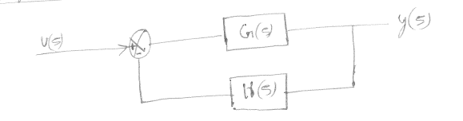

# Second Order Systems.
---

## Importance.
Any higher order [Transfer Functions](Transfer%20Functions.md)  can be made to look like a second-order system by designing it in such that most poles are in far left of LHP(left hand plane) except the dominant  near the imaginary axis. 
You use your time domain specifications to design dominant poles.

---
## Some important concepts.
---
### DC Gain:
It is the ratio of steady state output to input.
$$
k=\lim_{t\to\infty}f(t)=\lim_{s\to0}sF(s)=\lim_{s\to0s}H(s)G(s)
$$
for step input $H(s)=\frac{1}{s}$ 
$$\implies k=\lim_{s\to0}G(s)$$

---
### Standard Feedback System.

Remember that $\frac{Y(s)}{U(s)}=\frac{G(s)}{1+G(s)H(s)}$.

---
### Standard Second Order System.
$G(s)=\frac{K}{s(As+B)}$
$H(s)=1$
$$\frac{Y(s)}{U(s)}=\frac{\omega_n^2}{s^2+2\xi\omega_ns+\omega_n^2}$$
$\omega_n=\sqrt\frac{K}{A}$, $\xi=\frac{B}{2\sqrt{KA}}$
Let $\sigma=\xi\omega_n$ and $\omega_d=\omega_n\sqrt{1-\xi^2}$
$\implies$ poles of transfer function are $\sigma=\pm j\omega_d$.

---
#### Underdamped system ($0<\xi<1$).
$$Y(t) = 1 - e^{-\xi\omega_nt}(\cos{\omega_dt}+\frac{\xi}{\sqrt{1-\xi^2}}\sin{\omega_dt}) = 1 - \frac{e^{-\xi\omega_nt}}{\sqrt{1-\xi^2}}\sin{\left(\omega_dt+\tan^{-1}{\frac{\sqrt{1-\xi^2}}{\xi}} \right)} $$

---
#### Critically damped system ($\xi=1$).
$$Y(t) = 1-e^{-\omega_nt}(1+\omega_nt) $$

---
#### Overdamped system ($\xi>1$).
$$Y(t) = 1+\frac{\omega_n}{2\sqrt{\xi^2-1}}\left( \frac{e^{-s_1t}}{s_1}-\frac{e^{-s_2t}}{s_2} \right) $$
$s_1=(\xi+\sqrt{\xi^2-1})\omega_n$ and $s_2=(\xi-\sqrt{\xi^2-1})\omega_n$

---
## Transient Response Specifications
---
### Definitions
- Delay Time ($t_d$): time required to reach 50% of steady state response.
- Rise Time ($t_r$): type will be given in question.
	- 10%-90%: underdamped.
	- 5%-95%: rarely used.
	- 0%-100%: overdamped.
- Peak Time ($t_p$): time required to reach first peak.
- Max Overshoot ($M_p$): $\frac{c(t_p)-c(\infty)}{c(\infty)}\cdot100\%$ , maximum deviation from steady state value.
- Settling Time ($t_s$): time required to settle to within some deviation from steady state value.
Generally $\xi=0.4-0.8$

---
### Expression for these specifications for underdamped case.
- $t_r=\frac{1}{w_d}\tan^{-1}{\frac{w_d}{-\sigma}}=\frac{1}{w_d}\tan^{-1}{\frac{-\sqrt{1-\xi^2}}{\xi}}$
- $t_p=\frac{\pi}{w_d}$
- $M_p=\exp{\left(\frac{-\xi}{\sqrt{1-\xi^2}}\pi\right)}\cdot100$
- $t_s=\frac{-\log{\frac{p}{100}}}{\xi\omega_n}$ , $p$ is the percentage settling.

---
## [Bode Plots.](Bode%20Plots..md) for second order system.
- $G(j\omega)=\frac{1}{\left(1-\frac{\omega^2}{\omega_n^2}\right)+j\cdot2\xi\frac{\omega}{\omega_n}}$
- magnitude $dB=-10\log{\left(\left(1-\frac{\omega^2}{\omega_n^2}\right)^2+\left(2\xi\frac{\omega}{\omega_n}\right)^2\right)}$
	- $\omega<<<\omega_n$  mag $dB=0$
	- $\omega>>>\omega_n$  mag $dB=-40\log\left(\frac{\omega}{\omega_n}\right)$
	- corner frequency $\omega=\omega_n$
	- slope for large frequencies= $-40dB/decade$
	- if $\xi<0.707$ resonance at $\omega=\omega_n\sqrt{1-2\xi^2}$ .
- phase $\phi=-\tan{\left(\frac{2\xi\frac{\omega}{\omega_n}}{1-\left(\frac{\omega}{\omega_n}\right)^2}\right)}$
	- $\omega<<\omega_n \implies \phi=0$
	- $\omega=\omega_n \implies \phi=-90$
	- $\omega>>>\omega_n \implies \phi=-180$
---
