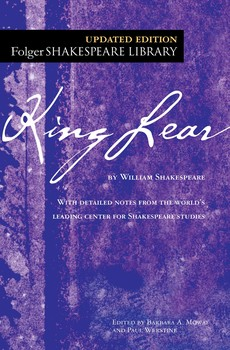

# King Lear
---

- [**Book**](https://www.folger.edu/explore/shakespeares-works/king-lear/read/)
- [**Audio Book**](https://www.gutenberg.org/files/26224/26224-index.html)
- **Full title** : The Tragedy of King Lear
- **Author** : William Shakespeare
- **Type of work** : Play
- **Genre** : Tragedy
- **Language** : English
- **Time and place written** : England, 1604–1605
- **Date of first publication** : First Folio edition, 1623
- **Publisher** : John Heminge and Henry Condell, two senior members of Shakespeare’s acting troupe
- **Narrator** : Not applicable (drama)
- **Climax** : Gloucester’s blinding in Act 3, scene 7
- **Protagonist** : Lear, king of Britain
- **Antagonists** : Lear’s daughters Goneril and Regan; Edmund, the bastard son of Gloucester
- **Setting (time)** : Eighth century B.C.
- **Setting (place)** : Various locations in England
- **Foreshadowing** : Goneril and Regan’s plotting in Act 1 foreshadows their later cruel treatment of Lear.
- **Tone** : Serious and tragic; the occasional bursts of comedy are uniformly dark
- **Themes** : Justice, authority versus chaos, reconciliation, redemption
- **Motifs** : Madness, betrayal, death
- **Symbols** : Weather plays an important symbolic role in the play, notably in Act 3, when the tremendous thunderstorm over the heath symbolizes Lear’s rage and mounting insanity; the actual blindness of Gloucester symbolizes the moral blindness that plagues both Lear and Gloucester himself in their dealings with their children; the “wheel” of fortune is another symbol by means of which Edmund, at the end of the play, conceives of his fall from power back into insignificance.

---
## Full Summary
Lear, the aging king of Britain, decides to step down from the throne and divide his kingdom evenly among his three daughters. First, however, he puts his daughters through a test, asking each to tell him how much she loves him. Goneril and Regan, Lear’s older daughters, give their father flattering answers. But Cordelia. Lear’s youngest and favorite daughter, remains silent, saying that she has no words to describe how much she loves her father. Lear flies into a rage and disowns Cordelia. The king of France, who has courted Cordelia, says that he still wants to marry her even without her land, and she accompanies him to France without her father’s blessing.

Lear quickly learns that he made a bad decision. Goneril and Regan swiftly begin to undermine the little authority that Lear still holds. Unable to believe that his beloved daughters are betraying him, Lear slowly goes insane. He flees his daughters’ houses to wander on a heath during a great thunderstorm, accompanied by his Fool and by Kent, a loyal nobleman in disguise.

Meanwhile, an elderly nobleman named Gloucester also experiences family problems. His illegitimate son, Edmund, tricks him into believing that his legitimate son, Edgar, is trying to kill him. Fleeing the manhunt that his father has set for him, Edgar disguises himself as a crazy beggar and calls himself “Poor Tom.” Like Lear, he heads out onto the heath.

When the loyal Gloucester realizes that Lear’s daughters have turned against their father, he decides to help Lear in spite of the danger. Regan and her husband, Cornwall, discover him helping Lear, accuse him of treason, blind him, and turn him out to wander the countryside. He ends up being led by his disguised son, Edgar, toward the city of Dover, where Lear has also been brought.

In Dover, a French army lands as part of an invasion led by Cordelia in an effort to save her father. Edmund apparently becomes romantically entangled with both Regan and Goneril, whose husband, Albany, is increasingly sympathetic to Lear’s cause. Goneril and Edmund conspire to kill Albany.

The despairing Gloucester tries to commit suicide, but Edgar saves him by pulling the strange trick of leading him off an imaginary cliff. Meanwhile, the English troops reach Dover, and the English, led by Edmund, defeat the Cordelia-led French. Lear and Cordelia are captured. In the climactic scene, Edgar duels with and kills Edmund; we learn of the death of Gloucester; Goneril poisons Regan out of jealousy over Edmund and then kills herself when her treachery is revealed to Albany; Edmund’s betrayal of Cordelia leads to her needless execution in prison; and Lear finally dies out of grief at Cordelia’s passing. Albany, Edgar, and the elderly Kent are left to take care of the country under a cloud of sorrow and regret.

---
- ## [Characters](Characters.md)
- ## [Analysis](Analysis.md)
- ## [Quotes](Quotes.md)
- ## Literary Devices 
	- ### [Themes](Themes.md)
	- ### [Motifs](Motifs.md)
	- ### [Symbols](Symbols.md)
	- ### [Protagonist](Protagonist.md)
	- ### [Antagonist](Antagonist.md)
	- ### [Language](Style.md)
	- ### [Tone](Tone.md)
- ## [Literary Essay](Literary%20Essay.md)
- ## [Historical Essay](Historical%20Essay.md)
- ## [Central Ideas.](Central%20Ideas..md)
- ## [Animal Imagery](Animal%20Imagery.md)
- ## [Ending Explained](Ending%20Explained.md)
---

