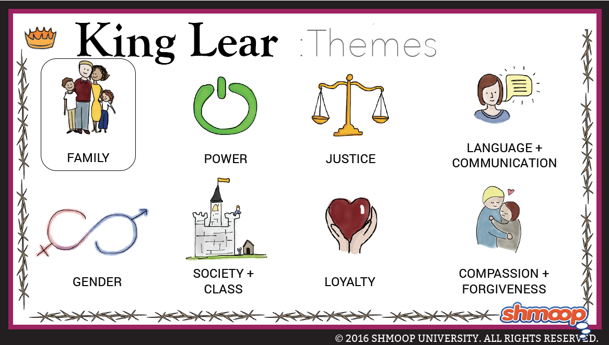

# Themes
---
**Themes are the fundamental and often universal ideas explored in a literary work.**

## Justice
_King Lear_ is a brutal play, filled with human cruelty and awful, seemingly meaningless disasters. The play’s succession of terrible events raises an obvious question for the characters—namely, whether there is any possibility of justice in the world, or whether the world is fundamentally indifferent or even hostile to humankind. Various characters offer their opinions: “As flies to wanton boys are we to the gods; / They kill us for their sport,” Gloucester muses, realizing it foolish for humankind to assume that the natural world works in parallel with socially or morally convenient notions of justice (4.1.37–38). Edgar, on the other hand, insists that “the gods are just,” believing that individuals get what they deserve (5.3.169). But, in the end, we are left with only a terrifying uncertainty—although the wicked die, the good die along with them, culminating in the awful image of Lear cradling Cordelia’s body in his arms. There is goodness in the world of the play, but there is also madness and death, and it is difficult to tell which triumphs in the end.

---
## Authority versus Chaos
_King Lear_ is about political authority as much as it is about family dynamics. Lear is not only a father but also a king, and when he gives away his authority to the unworthy and evil Goneril and Regan, he delivers not only himself and his family but all of Britain into chaos and cruelty. As the two wicked sisters indulge their appetite for power and Edmund begins his own ascension, the kingdom descends into civil strife, and we realize that Lear has destroyed not only his own authority but _all_ authority in Britain. The stable, hierarchal order that Lear initially represents falls apart and disorder engulfs the realm.

The failure of authority in the face of chaos recurs in Lear’s wanderings on the heath during the storm. Witnessing the powerful forces of the natural world, Lear comes to understand that he, like the rest of humankind, is insignificant in the world. This realization proves much more important than the realization of his loss of political control, as it compels him to re-prioritize his values and become humble and caring. With this newfound understanding of himself, Lear hopes to be able to confront the chaos in the political realm as well.

---
## Reconciliation
Darkness and unhappiness pervade _King Lear,_ and the devastating Act 5 represents one of the most tragic endings in all of literature. Nevertheless, the play presents the central relationship—that between Lear and Cordelia—as a dramatic embodiment of true, self-sacrificing love. Rather than despising Lear for banishing her, Cordelia remains devoted, even from afar, and eventually brings an army from a foreign country to rescue him from his tormentors. Lear, meanwhile, learns a tremendously cruel lesson in humility and eventually reaches the point where he can reunite joyfully with Cordelia and experience the balm of her forgiving love. Lear’s recognition of the error of his ways is an ingredient vital to reconciliation with Cordelia, not because Cordelia feels wronged by him but because he has understood the sincerity and depth of her love for him. His maturation enables him to bring Cordelia back into his good graces, a testament to love’s ability to flourish, even if only fleetingly, amid the horror and chaos that engulf the rest of the play.

---
## Nihilism
_King Lear_ presents a bleak vision of a world without meaning. Lear begins the play valuing justice, the social order, and the value of kingship, but his values are undermined by his experiences. Lear ends up believing that justice, order and kingship are just flattering names for raw, brutal power. Cornwall confirms Lear’s view when he admits that even though punishing Gloucester without a trial is unjust, his power gives him the freedom to act as he wants: “our power / Shall do a courtesy to our wrath” (III.vii). Gloucester, too, comes to see life as random, violent and cruel, claiming the gods treat people with the same level of care as schoolboys with flies. Nowhere does _King Lear_ suggest life offers meaning or the possibility of redemption. The play’s tragic ending offers no lesson. Cordelia dies for no reason; the order for her execution has been reversed. The few characters left alive express despair at what they have seen.

---
## Self-knowledge
_King Lear_ shows that a lack of self-knowledge can cause chaos and tragedy, but the play also suggests that self-knowledge is painful, and perhaps not worth the effort it takes to achieve it. Lear’s tragic flaw is a lack of self-knowledge. His daughter Regan identifies this flaw in the play’s opening scene: “he hath ever but slenderly known himself.” (I.i.). Lear achieves self-knowledge, but at the cost of his wealth, power and sanity. What he learns about himself is not a pleasant discovery: “I am a very foolish, fond old man” (IV.vii.). Achieving self-knowledge does not allow Lear to escape his tragic fate. In fact, self-knowledge makes his suffering worse. He realizes that his daughter Cordelia loves him after all, which only makes her death more painful. Edmund’s story also suggests that self-knowledge is of limited value. Unlike Lear, Edmund sees himself clearly from the beginning of the play, but his self-knowledge doesn’t do him much good: he dies before Lear does.

---
## The Unreliability of Speech
_King Lear_ suggests that people’s speeches and words are not always reliable and trustworthy. The tragic events of _King Lear_ are set in motion because Lear believes the loving speeches Goneril and Regan make, even though they are obviously deceitful. Goneril claims her love makes “speech unable” (I.i.) which is emptied of meaning because she is in the middle of a long speech. Kent argues that simple speech, like Cordelia’s, is trustworthy: “Nor are those empty-hearted, whose low sounds / Reverb no hollowness” (I.i.), but Cornwall argues that simple speech can be just as unreliable as elaborate flattery. Edgar suggests that language can never reliably express suffering. At the end of the play, Lear’s behavior suggests that Edgar is correct. When he finds his daughter Cordelia dead, Lear abandons language altogether: “Howl, howl, howl, howl” (V.iii.).

---
